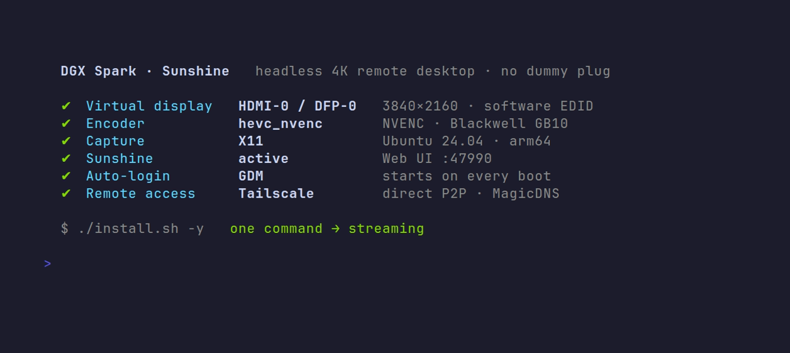

# NVIDIA DGX Spark Sunshine Streaming Setup


One-command installer that sets up [Sunshine](https://github.com/LizardByte/Sunshine) + a virtual X11 display on NVIDIA DGX Spark (GB10), so you can stream the desktop with Moonlight without a monitor attached.

## Quick Start

```bash
git clone https://github.com/seanGSISG/dgx-spark-sunshine-setup.git
cd dgx-spark-sunshine-setup
./install.sh
sudo reboot
./after-install.sh
```

### Non-interactive install

For unattended runs (CI, Ansible, a one-shot remote command), pass `-y` / `--yes`
(or export `NONINTERACTIVE=1`). Every prompt takes its default; defaults are
overridable via environment variables:

```bash
# Headless, fully unattended, with explicit choices
NONINTERACTIVE=1 INSTALL_MODE=headless RESOLUTION=2560x1440 REFRESH_RATE=120 \
CODEC=hevc BITRATE_MBPS=100 EDID_SOURCE=bundled \
ENABLE_AUTOSTART=1 ENABLE_AUTOLOGIN=1 INSTALL_TAILSCALE=0 \
./install.sh -y

# Simplest form — take every default (monitor mode)
./install.sh -y
```

| Env var | Default | Values / notes |
|---------|---------|----------------|
| `INSTALL_MODE` | `monitor` | `monitor` or `headless` |
| `RESOLUTION` | `2560x1440` | e.g. `3840x2160`, `1920x1080` |
| `REFRESH_RATE` | `120` | Hz |
| `CODEC` | `hevc` | `hevc`, `av1`, `h264` |
| `BITRATE_MBPS` | `100` | 20–300 |
| `EDID_SOURCE` | `bundled` | `bundled` or `custom` (set `CUSTOM_EDID_PATH`) |
| `ENABLE_AUTOSTART` | `1` | enable the sunshine user service on login |
| `ENABLE_AUTOLOGIN` | `1` headless / `0` monitor | GDM autologin + disable Wayland |
| `INSTALL_TAILSCALE` | `0` | install/configure Tailscale |
| `CSRF_ALLOWED_ORIGINS` | auto-detected | comma-separated `https://` Web UI origins (LAN/Tailscale/host) |

Run `./install.sh --help` for the full flag/env reference.

Then open Sunshine Web UI and pair Moonlight:

- `https://<YOUR_DGX_IP>:47990`
- Moonlight client: https://moonlight-stream.org

## Overview

### What the Installer Does

- Creates backups in `~/.sunshine-setup-backups/`
- Installs Sunshine (ARM64 .deb)
- Installs EDID to `/etc/X11/4k120.edid`
- Generates `/etc/X11/xorg.conf` using NVIDIA `CustomEDID`
- Writes Sunshine config to `~/.config/sunshine/sunshine.conf`
- Installs a systemd **user** service for Sunshine
- Optionally enables autostart and attempts to enable lingering (`sudo loginctl enable-linger $(whoami)`)
- Optionally offers to install/configure Tailscale

### Requirements

- DGX Spark (GB10), Ubuntu 24.04
- X11 desktop session on the DGX (Sunshine captures an X session on `:0`)
  - For headless operation, you typically need desktop auto-login so a session exists after reboot

### Tested On



Last verified working on **2026-06-02** with a headless, non-interactive install:

| Component | Version |
|-----------|---------|
| System | NVIDIA DGX Spark (GB10, 128 GB unified LPDDR5x) |
| OS | DGX OS / Ubuntu 24.04.4 LTS (Noble), arm64 |
| Kernel | 6.17.0-1014-nvidia |
| NVIDIA driver | 580.142 |
| Sunshine | 2026.516.143833 |
| Profile | headless · 2560x1440@120 · HEVC · 100 Mbps · bundled Samsung Q800T EDID |

### Hardware Limitation (GB10)

GB10 has a ~165 MHz pixel clock limit. Practical impact: 4K@120Hz won't work; 4K@60Hz and 1440p@120Hz do.

### Note: GB10 PCI domain & Xorg BusID

On the GB10 the GPU sits in a **non-zero PCI domain** (e.g. `000f:01:00.0`,
shown by `nvidia-smi` as `0000000F:01:00.0`). The Xorg `BusID "PCI:bus:dev:func"`
string has no way to express a PCI domain, so a generated `BusID` like
`PCI:1:0:0` points at the wrong (domain-0) address and X finds no device. For
single-GPU systems the installer **omits `BusID`** and lets the NVIDIA driver
auto-detect the GPU. Symptom if this is wrong: the autologin Xorg session dies
with `(EE) No devices detected` / `no screens found`, GDM falls back to the
greeter, and Sunshine never starts (it can't bind `:47990`).

### Repository Structure

```
dgx-spark-sunshine-setup/
├── install.sh              # Main installation script
├── after-install.sh        # Post-reboot configuration
├── uninstall.sh            # Removal script
├── setup.md                # Detailed setup guide
├── edid/                   # EDID files for virtual displays
├── img/                    # Documentation images
└── templates/              # Configuration templates
    ├── xorg.conf.template
    ├── sunshine.conf.template
    ├── sunshine.service
    ├── sunshine-override.conf
    ├── tailscale-autoconnect.service
    └── tailscale-autoconnect.env.template
```

## Technical Details

### Virtual Display Technology

This setup uses NVIDIA's proprietary **CustomEDID** option in xorg.conf to create a virtual display without a physical monitor. The EDID (Extended Display Identification Data) file tells the GPU what resolutions and refresh rates the "monitor" supports.

Key differences from other approaches:
- **No kernel parameters needed** - Works with NVIDIA's proprietary driver
- **No dummy HDMI plug required** - Completely virtual
- **Persistent across reboots** - Configured in X11, not runtime

### Hardware Encoding

Sunshine is configured to use NVIDIA's **NVENC** hardware encoder, which:
- Offloads video encoding from CPU to dedicated GPU hardware
- Achieves high quality at high bitrates with minimal performance impact
- Supports HEVC, H.264, and AV1 codecs
- Uses negligible VRAM (~100-200 MB)

### Performance Impact

When idle (not streaming):
- **CPU**: ~0%
- **GPU**: ~0%
- **Memory**: ~100 MB

When actively streaming 1440p @ 120Hz:
- **CPU**: ~5-10% (one core)
- **GPU**: ~10-20% (encoding only)
- **Memory**: ~200 MB
- **Network**: Based on your selected bitrate

## Configuration

### X Session Environment (DISPLAY/XAUTHORITY)

The Sunshine user service needs access to your X session. Don't hardcode `XAUTHORITY` in the systemd override; instead, export it into the systemd user manager at session start:

```bash
dbus-update-activation-environment --systemd DISPLAY XAUTHORITY
systemctl --user show-environment | grep -E 'DISPLAY|XAUTHORITY'
```

If you want it to run every login, `~/.xprofile` is a simple option on many desktops.

### Tailscale (Optional)

During install you can choose to install Tailscale.

- The installer can enable `tailscaled` and optionally run `sudo tailscale up`
- It can also install an optional boot-time unit `templates/tailscale-autoconnect.service` that runs `tailscale up` on boot
  - Default is safe: it does **not** disable DNS and does **not** include tags
  - If you want Tailscale SSH later, set `TS_UP_EXTRA_ARGS="--ssh"` in `/etc/default/tailscale-autoconnect`

> **Disable key expiry** for the Spark in the [Tailscale admin console](https://login.tailscale.com/admin/machines)
> (device → `…` → *Disable key expiry*). Otherwise the node's key expires
> (~every 90 days) and drops off the tailnet, locking you out remotely until
> you re-authenticate at the console.

### iPad / SSH Setup

See [setup.md](setup.md) for a step-by-step guide for:

- Configuring everything from another computer via SSH
- Configuring using only an iPad (Moonlight + Safari + SSH)

## Troubleshooting

### Web UI: "CSRF protection blocked request from origin"

Sunshine 2026.516+ rejects browser requests whose `Origin` isn't allow-listed,
so the UI loads but every action fails. The installer auto-fills
`csrf_allowed_origins` with the host's LAN/Tailscale IPs, hostname, and (if
Tailscale is up) its MagicDNS name. If you reach the UI by a different address
(new IP, reverse proxy, extra hostname), add it:

```bash
# ~/.config/sunshine/sunshine.conf — comma-separated, https:// prefixes
csrf_allowed_origins = https://192.168.1.50:47990,https://myhost.example.ts.net:47990
systemctl --user restart sunshine
```

`localhost` is always allowed; there is no way to disable the check.

### Sunshine Service Status

```bash
systemctl --user status sunshine
journalctl --user -u sunshine -n 200 --no-pager
```

> **Managing over SSH:** `systemctl --user` commands need the user runtime
> directory to find the session bus. If they fail with "Failed to connect to
> bus" or report the service as not found, export it first:
>
> ```bash
> export XDG_RUNTIME_DIR=/run/user/$(id -u)
> systemctl --user restart sunshine
> ```

### Black Screen / Capture Issues

- Ensure a graphical session exists on the DGX (`DISPLAY=:0`). If nobody logs in, there may be nothing to capture
- Ensure the systemd user environment has `XAUTHORITY`:

```bash
systemctl --user show-environment | grep -E 'DISPLAY|XAUTHORITY'
```

- **Black screen with only a mouse cursor** (Sunshine connects, but the desktop
  is blank): the virtual display isn't attaching, so X has no real framebuffer.
  Check the screen size and connectors:

```bash
DISPLAY=:0 XAUTHORITY=/run/user/1000/gdm/Xauthority xrandr --query
```

  If you see `current 8 x 8` (or 640x480) and every output `disconnected`, the
  custom EDID is being forced onto a connector that doesn't exist. On the GB10
  the real heads are `DFP-0` (HDMI / Internal TMDS) and `DFP-1..4` (USB-C
  DisplayPort) — **not** `TV-0`. The installer forces the EDID onto `DFP-0`; a
  healthy box shows `HDMI-0 connected primary 3840x2160`.

### Autostart After Reboot

Systemd user services may require lingering.

```bash
sudo loginctl enable-linger $(whoami)
loginctl show-user $(whoami) --property=Linger
```

Policy note: `loginctl enable-linger` is governed by PolicyKit (`org.freedesktop.login1.set-user-linger`). If PolicyKit is missing/restrictive, it may fail with "Access denied"; `sudo loginctl ...` is the fallback.

### Low Performance / Stuttering

If streaming is choppy or low quality:

```bash
# Check GPU utilization
nvidia-smi

# Monitor encoding performance
journalctl --user -u sunshine -f | grep -i "encoder\|fps"

# Adjust bitrate in ~/.config/sunshine/sunshine.conf
# Lower bitrate for unstable connections
# Increase bitrate for LAN with stable gigabit connection
```

### Remote Streaming Capped / Laggy over Tailscale (relay vs direct)

When streaming over Tailscale, you want a **direct** (peer-to-peer) connection,
not a **relay** (DERP) one. Relay routes traffic through Tailscale's servers —
extra latency and throttled throughput — and is only a fallback when direct P2P
can't be established. Check while a stream is active:

```bash
tailscale status   # look for 'direct <ip>:<port>' vs 'relay "den"' next to the peer
tailscale netcheck # 'UDP: true' and 'MappingVariesByDestIP: false' favor direct
```

If you're stuck on relay, the usual cause is a firewall blocking UDP. Allow
outbound **UDP 41641** (and don't block UDP generally) on the network so
Tailscale can punch a direct path. There is no benefit to forcing relay — direct
is always preferable for low-latency, full-bandwidth streaming.

### Credentials Reset

If you forgot Sunshine username/password:

```bash
# Stop Sunshine
systemctl --user stop sunshine

# Remove credentials file
rm ~/.config/sunshine/sunshine_state.json

# Start Sunshine
systemctl --user start sunshine

# Reconfigure at https://localhost:47990
```

### Connectivity

```bash
curl -k https://localhost:47990
sudo ufw status
```

## Advanced Usage

### Backups

All backups are automatically created in `~/.sunshine-setup-backups/` with timestamps:

```
~/.sunshine-setup-backups/YYYYMMDD-HHMMSS/
├── xorg.conf                    # Original X11 configuration
├── *.edid                       # Original EDID files
├── sunshine/                    # Original Sunshine configuration
└── sunshine-override.conf       # Original systemd override
```

To restore a backup:
```bash
# Navigate to backup directory
cd ~/.sunshine-setup-backups/YYYYMMDD-HHMMSS/

# Restore xorg.conf
sudo cp xorg.conf /etc/X11/xorg.conf

# Restore Sunshine config
cp -r sunshine/* ~/.config/sunshine/

# Reboot
sudo reboot
```

### Custom EDID Files

If the bundled Samsung Q800T EDID doesn't work for your use case:

1. Extract EDID from your monitor (on another system):
   ```bash
   # Linux
   cat /sys/class/drm/card0-HDMI-A-1/edid > my-monitor.bin

   # Windows (use tools like Custom Resolution Utility)
   ```

2. Run installer and select "custom EDID" option
3. Provide path to your .bin file

**Note**: Custom EDIDs must respect GB10's 165 MHz pixel clock limitation.

### Changing Configuration

To change resolution, codec, or bitrate after installation:

1. Edit `~/.config/sunshine/sunshine.conf`
2. Restart Sunshine:
   ```bash
   systemctl --user restart sunshine
   ```

For display resolution changes, you'll need to:
1. Obtain a compatible EDID file
2. Replace `/etc/X11/4k120.edid`
3. Reboot

### Uninstalling

Run the uninstaller as your normal user (do not run it under sudo):

```bash
./uninstall.sh
```

Or manually remove the installation:

```bash
# Stop and disable Sunshine
systemctl --user stop sunshine
systemctl --user disable sunshine

# Remove Sunshine
sudo apt-get remove sunshine

# Restore original configurations from backup
cd ~/.sunshine-setup-backups/YYYYMMDD-HHMMSS/
sudo cp xorg.conf /etc/X11/xorg.conf

# Reboot
sudo reboot
```

## Contributing

This is a community project for DGX Spark users. Contributions welcome!

### Reporting Issues

Please include:
- DGX OS version (`cat /etc/dgx-release`)
- NVIDIA driver version (`nvidia-smi`)
- Selected configuration (resolution, codec, bitrate)
- Relevant logs (`journalctl --user -u sunshine`)

### Pull Requests

Improvements to the installer, documentation, or EDID files are welcome.

## Resources

### Official Documentation
- **Sunshine GitHub**: https://github.com/LizardByte/Sunshine
- **Sunshine Docs**: https://docs.lizardbyte.dev/projects/sunshine/
- **Moonlight**: https://moonlight-stream.org
- **NVIDIA DGX Spark**: https://docs.nvidia.com/dgx/dgx-spark/

### Related Projects
- **DGX Spark Playbooks**: https://github.com/NVIDIA/dgx-spark-playbooks
- **DGX Spark Portal**: https://build.nvidia.com/spark

### EDID Resources
- **Linux TV EDID Repository**: https://git.linuxtv.org/v4l-utils.git/tree/utils/edid-decode/data
- **EDID Decode Tool**: `apt-get install edid-decode`

## License

This project is licensed under the MIT License - see the LICENSE file for details.

## Acknowledgments

- **Sunshine/Moonlight Team** - For the excellent streaming protocol
- **NVIDIA** - For DGX Spark hardware and driver support
- **Linux TV Project** - For the EDID database
- **Community Contributors** - For testing and feedback
